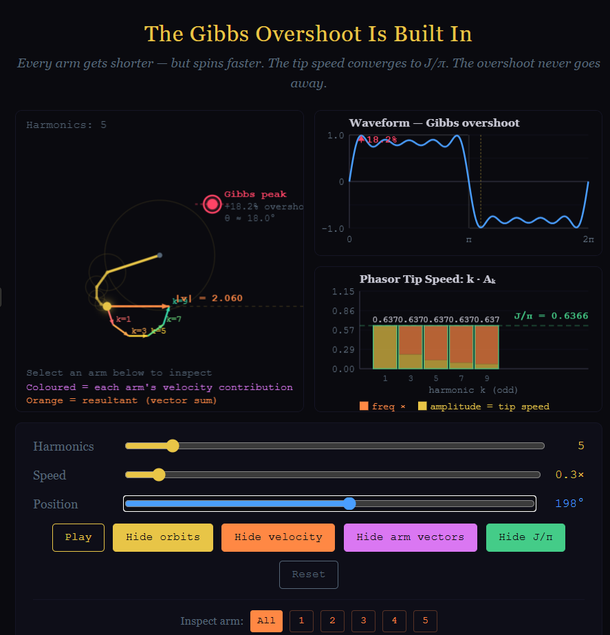

# Fourier-Gibbs-Phenomenon-Explained-Geometrically

https://ninjas1337.github.io/Fourier-Gibbs-Phenomenon-Explained-Geometrically/


An inuitive approach to Fourier and an geometrical explanation of the Gibbs Phenomenon
The Gibbs Overshoot Is Built In
An interactive visualization showing why the Gibbs overshoot exists, why it converges to ≈ 8.95%, and why it can never go away — explained geometrically through phasor chains and tip speed.
Motivation
Most Fourier series demonstrations show you that the overshoot happens. This one shows you why.
When I studied Fourier series, I was told the Gibbs phenomenon is an unavoidable artifact of approximating a discontinuity with smooth functions. That is true, but it is not satisfying. It does not tell you what is actually happening.
What made it click for me was looking at the phasor chain — the rotating vector arms that build up a Fourier partial sum — and noticing something:
Every arm gets shorter. Every arm spins faster. But the tip speed of each arm converges to the same value.
That value is J/π, where J is the jump magnitude. It falls straight out of the Fourier coefficients. And it explains everything.
What this project shows
This visualization lets you see the Fourier series as geometry:
Phasor chain — each harmonic is a rotating arm. Higher harmonics have shorter arms but spin faster. The chain of arms traces out the partial sum.
Resultant velocity — the orange arrow shows the velocity of the chain tip. Near the discontinuity, all arm velocities align. The tip accelerates. That is the overshoot.
Arm vectors — toggle individual velocity contributions for each arm. At the jump, they all point the same direction. Away from the jump, they scatter and cancel.
Phasor Tip Speed spectrum — each bar shows k · Aₖ for that harmonic. The bars flatten to the J/π plateau. The two-tone decomposition (frequency × amplitude) shows how higher harmonics compensate their shrinking radius with faster spin.
Vector polygons — as you drag the position slider, the arm vectors form geometric shapes. At the Gibbs peak they form a semicircle. Then a pentagon. Then a triangle. Then a star. Each shape corresponds to a point on the waveform. The Fourier series is a choreography of vector polygons.
The key insight
At a discontinuity, the Fourier coefficient of the k-th harmonic decays as Aₖ ~ J/(kπ). The phasor tip speed is:
PTSₖ = k · Aₖ → J/π
Every harmonic contributes equally to the tip velocity. No harmonic is more or less active than any other. When these equal contributions align at the discontinuity, the resultant tip races past the target value. Adding more harmonics adds more equal-speed contributors that also align — the surge does not weaken, it just gets narrower.
The overshoot converges to:
Si(π)/π ≈ 1.0895
which is approximately 8.95% above the target. This is a consequence of equal-length vectors fanning from alignment into a semicircle. The ratio of the chord to the arc at the point of maximum displacement is Si(π)/π. It is a geometric constant — a signature of Euclidean space.
The π/2 phase lag
There is a subtlety visible in the visualization: the Gibbs peak does not occur at the same angle as the maximum resultant velocity. The velocity peaks at the discontinuity (θ = 0), but the overshoot peak occurs slightly after, at θ ≈ π/N.
This is the same π/2 phase relationship between velocity and displacement that governs every oscillating system. The partial sum is the integral of the Dirichlet kernel. The peak of an integral always lags the peak of the integrand. The same π/2 that lives in every AC phasor diagram lives here too.
What it is not
This is not conservation of angular momentum. The visual resemblance is striking — shorter arms, faster spin, constant product — but the mechanism is different. In a physical system, angular momentum is conserved through dynamic compensation (Noether's theorem, rotational symmetry). Here, nothing is being conserved or exchanged. Each phasor arm has a fixed radius and a fixed spin rate from the moment it exists. The equality of tip speeds is a structural fingerprint of the discontinuity, not a physical law.

The big WHY:
## How the overshoot works: vector addition!

At position θ = 0 (the discontinuity), every arm's velocity
contribution points in the same direction. The vectors are fully
aligned. The resultant velocity is at its maximum — it is the scalar
sum of all individual tip speeds, approximately N × J/(2π). The chain
tip is racing upward through the midpoint of the jump at full speed.

As θ advances, each arm's velocity vector rotates at a rate
proportional to its harmonic number k. Higher harmonics rotate faster.
The vectors fan out. The resultant — obtained by vector addition — is
still mostly upward, but shrinking as the fan opens.

The overshoot is the **accumulated displacement** during this process:
the integral of the resultant velocity from full alignment (θ = 0) to
the point where the vectors first form a semicircle (θ ≈ π/N). At the
semicircle, the resultant velocity has decayed to near zero — the
vectors partially cancel — and the chain tip stops climbing. That is
the Gibbs peak.

The total displacement accumulated during the fanning process is:

```
S_N(x₀ + π/N) - f(x₀⁻)  →  (J/π) · Si(π)  ≈  1.18 · J/2
```

which exceeds the target midpoint value by approximately 8.95%.

**Why it never vanishes:** adding more harmonics has two effects that
cancel exactly. The initial resultant velocity grows (more aligned
vectors), but the interval shrinks (the semicircle is reached at a
smaller angle, π/N). The product — velocity × interval width — remains
constant. In the limit, the discrete vector sum becomes the continuous
integral Si(π), and the overshoot converges to J(Si(π)/π − 1/2) ≈
0.0895 J.

Nothing is approximated away. The overshoot is a geometric
consequence of summing equal-length vectors that fan from alignment
into a semicircle. The displacement accumulated during that fanning is
a definite integral — Si(π) — and it is independent of N.


How to use it

Harmonics slider — add or remove Fourier harmonics
Speed slider — control animation speed
Position slider — drag manually to scrub through the waveform; pause and explore
Show velocity — orange arrow showing the resultant tip velocity
Show arm vectors — coloured arrows showing each arm's velocity contribution, chained as vector addition
Show J/π — the target plateau on the PTS spectrum
Inspect arm — click an arm number to highlight it across all three panels
Show orbits — ghost circles for each harmonic

HERE IS THE FULL PAPER ON THE GIBBS PHENOMENA AND THIS INTUITIVE APPROACH EXPLAINED MATHEMATICALLY: [Open assets folder](assets/Gibbs_Phenomenon___A_Kinematic_Phasor_Approach.pdf)


See also

Complex Numbers Are Not Imaginary — a companion project showing what a complex number is, geometrically, through a tilting circle with radius π.

Note
This project is for educational and informational purposes. It is a geometric intuition tool built on standard Fourier analysis. The phasor tip speed observation and its connection to the Gibbs constant are described in more detail in an accompanying paper.
Idea
If this helps someone see that the Gibbs overshoot is not a numerical accident but a geometric inevitability — equal-length vectors fanning into a semicircle — then it has done its job.
